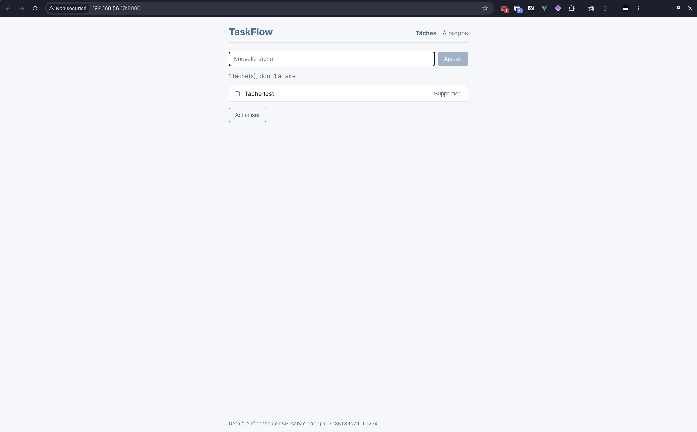

# Fil rouge 4 — Deployments et Services

[Retour au sommaire](../../ANSWERS.md)

## Étape 1 — Nettoyage et organisation

Le contexte actif est `k3s-lab`. Les anciens Pods isolés ont été supprimés :

```sh
kubectl delete pod api db -n taskflow
kubectl get pods -n taskflow
```

Les deux suppressions ont été confirmées, puis la commande de consultation a retourné `No resources found in taskflow namespace.` Le namespace est conservé.

Un Service sélectionne les Pods par leurs labels, indépendamment de leur création par un Deployment. Garder les anciens Pods avec les mêmes labels pourrait donc envoyer une partie du trafic vers eux. Pour PostgreSQL sans réplication, cela pourrait même répartir les connexions entre deux bases indépendantes.

Les anciens manifestes `k8s/pods/` sont supprimés. Le namespace est déplacé vers `k8s/app/00-namespace.yaml` : le préfixe `00-` le place avant les composants lors de l'application du répertoire. `k8s/k3s-config.yaml` reste hors de ce répertoire, car il configure le service k3s et ne décrit pas une ressource Kubernetes.

## Étape 2 — Base de données

`k8s/app/db.yaml` regroupe le Deployment et le Service PostgreSQL. Le Deployment utilise une seule réplique et la stratégie `Recreate` : lors d'une mise à jour, l'ancien Pod est arrêté avant la création du nouveau. On évite ainsi un remplacement progressif faisant cohabiter deux bases indépendantes. Cela implique une interruption pendant le remplacement et ne rend pas les données persistantes.

Le Service `db`, comme le nom utilisé dans Compose, expose le port `5432` vers le port `5432` du conteneur. Son type `ClusterIP` permet aux autres Pods de le joindre dans le cluster sans publier de port sur le poste.

L'image `postgres:18` et les variables de l'ancien Pod sont conservées. Le sujet cite `postgres:17-alpine` dans ses prérequis, mais notre TP précédent utilisait déjà PostgreSQL 18. Le mot de passe reste la valeur fictive du TP. Conformément au sujet, aucun stockage persistant, aucune sonde et aucune limite de ressources ne sont ajoutés à ce stade.

Après application des manifestes, le namespace est resté inchangé et le Deployment ainsi que le Service `db` ont été créés. `kubectl rollout status deployment/db -n taskflow --timeout=180s` a confirmé la fin du déploiement.

Résultats observés :

| Ressource | État |
| --- | --- |
| Deployment `db` | `1/1` prêt, 1 réplique à jour et disponible |
| Service `db` | `ClusterIP`, adresse `10.43.204.112`, port `5432/TCP` |
| Pod `db-fc65bd6f6-vwj9k` | `1/1 Running`, 0 redémarrage, IP `10.42.0.22`, nœud `k3s-lab` |

Les logs capturés immédiatement après le déploiement montrent encore l'initialisation de PostgreSQL (création des répertoires et fichiers de configuration). En l'absence de sonde, l'état prêt du Pod ne suffit pas à confirmer que PostgreSQL accepte déjà les connexions.

Les vérifications complémentaires (logs, EndpointSlices et `pg_isready` depuis un Pod temporaire) ont ensuite été confirmées comme réussies. La commande suivante a validé l'accès par le nom de Service `db` :

```sh
kubectl run db-check -n taskflow \
  --image=postgres:17-alpine --restart=Never --rm -i \
  --command -- pg_isready -h db -p 5432 -U taskflow -d taskflow
```

L'image du Pod temporaire fournit uniquement le client de vérification ; elle ne change pas la version du serveur PostgreSQL.

## Étape 3 — API

`k8s/app/api.yaml` contient un Deployment de deux répliques de `tlemray/taskflow-api:1.0.0` et un Service `ClusterIP` nommé `api`, exposant le port `3000` vers le même port des conteneurs. Ce nom et ce port correspondent à la destination `http://api:3000` utilisée par le front.

`DB_HOST` vaut désormais `db`, sans IP de Pod. `DB_PORT` conserve la valeur explicite `"5432"` de notre ancien manifeste. Une valeur d'environnement doit être une chaîne YAML, même lorsqu'elle représente un nombre.

Le Service `db` existant avant les Pods API, Kubernetes peut injecter la variable `DB_PORT=tcp://<ClusterIP>:5432`. Notre code attend un entier : cette valeur provoquerait une erreur au démarrage si elle n'était pas remplacée. Deux solutions sont possibles : définir explicitement `DB_PORT: "5432"` dans les variables du conteneur, ou désactiver les liens de Services via `spec.template.spec.enableServiceLinks: false` et laisser le code utiliser son port par défaut. Nous conservons la première solution, plus explicite. Il s'agit ici d'un piège anticipé, pas d'un échec observé. Voir la [documentation des variables de Service](https://kubernetes.io/docs/concepts/services-networking/service/#environment-variables) et [enableServiceLinks](https://kubernetes.io/docs/tutorials/services/connect-applications-service/#accessing-the-service).

Le Deployment et le Service `api` ont été créés. La commande `kubectl rollout status deployment/api -n taskflow --timeout=180s` a confirmé la fin du déploiement. Les deux Pods observés sur `k3s-lab` sont :

| Pod | État | Redémarrages | IP |
| --- | --- | --- | --- |
| `api-76b6687769-9cjth` | `1/1 Running` | 0 | `10.42.0.25` |
| `api-76b6687769-ztwfw` | `1/1 Running` | 0 | `10.42.0.24` |

La base reste `1/1 Running` à `10.42.0.22`. La capture du déploiement ne contient pas les logs applicatifs.

Avec `kubectl port-forward -n taskflow service/api 18080:3000`, les tests HTTP ont donné :

| Requête | Résultat |
| --- | --- |
| `GET /healthz` | `200 OK`, `status: ok`, version `1.0.0`, hostname `api-76b6687769-ztwfw` |
| `GET /api/tasks` | `200 OK`, liste vide `[]` |

Les deux réponses portent `X-Served-By: api-76b6687769-ztwfw`. La lecture des tâches valide l'accès à PostgreSQL depuis cette instance. Le port-forward sur un Service sélectionne un Pod et y reste attaché : ces appels ne prouvent pas la répartition du trafic entre les deux répliques.

Une boucle de dix appels à `http://api:3000/healthz` depuis le Pod temporaire `api-check` (image `nicolaka/netshoot`) a ensuite affiché les en-têtes `X-Served-By` : 7 réponses de `api-76b6687769-9cjth` et 3 de `api-76b6687769-ztwfw`. Les deux répliques reçoivent donc du trafic via le Service ; la répartition n'est pas nécessairement une alternance stricte. Le Pod temporaire a été supprimé automatiquement à la fin du test (`--rm`).

La version `2.0.0`, non préparée dans les TP précédents, sera créée avant le test de mise à jour.

## Étape 4 — Front : adaptation de Nginx

Avant le déploiement, la lecture de `front/nginx.conf.template` a révélé un résolveur codé en dur : `127.0.0.11`, propre au réseau Docker. Cette configuration ne convient pas aux Pods Kubernetes. Il s'agit d'un problème détecté dans le fichier, pas d'une panne observée sur le cluster.

Le template utilise désormais `proxy_pass ${API_URL};`. L'entrypoint officiel substitue `API_URL` avant de lancer Nginx ; avec `http://api:3000`, Nginx résout le nom du Service au démarrage via le résolveur système. Sans URI ajoutée à `proxy_pass`, le chemin `/api/...` est conservé. Voir la [documentation Nginx](https://nginx.org/en/docs/http/ngx_http_proxy_module.html#proxy_pass).

Cela implique que le Service `api` existe avant le démarrage du front. Sinon, Nginx échoue à résoudre son hôte et quitte ; Kubernetes relance le conteneur. Une fois le Service présent, un démarrage ultérieur peut réussir. La configuration Compose attend déjà la disponibilité de l'API avant le front. Si l'adresse de l'API change dans Docker, il faut relancer le front pour la résoudre à nouveau ; dans Kubernetes, le Service conserve son adresse lors du remplacement de ses Pods.

L'image front corrigée porte le tag `tlemray/taskflow-front:1.0.1`, au lieu d'écraser la version `1.0.0` citée par le sujet et utilisée lors du premier TP. Le comportement antérieur décrit dans le fil rouge 1 concerne l'ancienne image.

Après construction locale, la configuration de l'image `1.0.1` a été testée :

```sh
docker run --rm --add-host api:127.0.0.1 \
  tlemray/taskflow-front:1.0.1 nginx -t
```

L'entrypoint a généré la configuration à partir du template, puis Nginx a retourné `syntax is ok` et `test is successful`. L'entrée d'hôte ajoutée ne sert qu'au contrôle de configuration ; ce test ne valide pas les appels HTTP vers une API réelle.

`k8s/app/front.yaml` est préparé avec deux répliques de cette image, `API_URL=http://api:3000` et un Service `LoadBalancer`. Le port du Service est `8080`, pour éviter les ports `80` et `443` utilisés par Traefik sur la VM ; le port cible des conteneurs reste `80`. Les Services API et base restent de type `ClusterIP`.

Le push de `tlemray/taskflow-front:1.0.1` a réussi. L'application de tout le répertoire avec `kubectl apply -f k8s/app/` a laissé le namespace, l'API et la base inchangés, puis créé le Deployment et le Service du front. Le rollout du front s'est terminé avec succès.

État observé après déploiement :

| Deployment | Répliques prêtes | À jour | Disponibles |
| --- | --- | --- | --- |
| `api` | 2/2 | 2 | 2 |
| `db` | 1/1 | 1 | 1 |
| `front` | 2/2 | 2 | 2 |

| Service | Type | ClusterIP | Adresse externe | Ports affichés |
| --- | --- | --- | --- | --- |
| `api` | ClusterIP | `10.43.19.25` | aucune | `3000/TCP` |
| `db` | ClusterIP | `10.43.204.112` | aucune | `5432/TCP` |
| `front` | LoadBalancer | `10.43.86.169` | `192.168.56.10` | `8080:31682/TCP` |

Dans `kube-system`, le Pod `svclb-front-a782794a-hv2kl` est `1/1 Running`, sans redémarrage. Le Pod ServiceLB de Traefik reste `2/2 Running`. L'accès prévu depuis le navigateur du poste est `http://192.168.56.10:8080` ; aucun port-forward n'est nécessaire pour cet accès. Le port `31682` est le NodePort attribué au Service, distinct du port `8080` choisi pour l'accès LoadBalancer.

Les tests dans le navigateur sur `http://192.168.56.10:8080` ont été confirmés comme réussis : création de la tâche « Tester les Services Kubernetes », passage à l'état terminé, puis relecture après actualisation avec cet état conservé. Des noms d'instances API différents ont été observés dans le pied de page au fil des actualisations.

Le parcours navigateur → front → Service API → API → Service db → PostgreSQL fonctionne donc. La conservation d'une tâche après actualisation de la page ne prouve pas la persistance après suppression du Pod de base : ce dernier n'a toujours pas de volume persistant.

## Étape 5 — Auto-réparation et mise à jour

Le Pod `api-76b6687769-9cjth` a été supprimé pendant l'utilisation de l'application :

```sh
kubectl delete pod -n taskflow api-76b6687769-9cjth
kubectl get pods -n taskflow -l component=api -w
```

Un nouveau Pod `api-76b6687769-6kqlz` est apparu automatiquement, déjà `1/1 Running` au premier affichage, avec un âge de `0s` et aucun redémarrage. L'autre réplique, `api-76b6687769-ztwfw`, est restée `1/1 Running`, sans redémarrage, avec un âge de 15 minutes.

Le ReplicaSet géré par le Deployment a rétabli les deux répliques souhaitées. C'est un nouveau Pod, avec un nouveau nom, et non un redémarrage du conteneur supprimé. Aucune erreur n'a été observée dans le navigateur pendant ce test ; les noms d'instances API affichés ont changé. Cette observation ponctuelle ne garantit pas l'absence de toute interruption, notamment sans sonde de disponibilité.

Après le test de suppression d'un Pod front, deux répliques sont présentes : `front-7ddf57fd6b-hsklm` (`1/1 Running`, 0 redémarrage, âge de 3 min 23 s) et `front-7ddf57fd6b-klhql` (`1/1 Running`, 0 redémarrage, âge de 13 min). L'écart d'âge correspond au remplacement effectué. Le nom du Pod supprimé n'est pas visible dans la capture, mais les deux répliques attendues sont disponibles.

Aucun changement visible du fonctionnement du site n'a été signalé. Le pied de page affiche les noms des Pods API, pas ceux des Pods front : il ne permet pas d'observer directement le remplacement du front.

Pour préparer le test de mise à jour, la version de `api/package.json` et celle du paquet racine dans `api/package-lock.json` passent à `2.0.0`. Aucun comportement métier ni schéma de base n'est modifié : cette version sert à distinguer les instances lors du rollout via `/api/info`, qui lit déjà la version du paquet.

L'image `tlemray/taskflow-api:2.0.0` a été construite. Le contrôle `docker run --rm tlemray/taskflow-api:2.0.0 node -p "require('./package.json').version"` a retourné `2.0.0`, puis le push sur Docker Hub a réussi.

Le manifeste API a été passé à `2.0.0` et appliqué pendant une boucle de requêtes vers `http://192.168.56.10:8080/api/info`. La capture montre la transition suivante :

1. Réponses de la version `1.0.0` avec `HTTP 200`.
2. Une page Nginx `502 Bad Gateway`, avec `HTTP 502`.
3. Une erreur curl 28 : délai dépassé après environ 3 secondes, sans octet reçu. L'affichage `HTTP 000` signifie qu'aucun code HTTP n'a été reçu ; ce n'est pas un statut envoyé par le serveur.
4. Retour des réponses `HTTP 200` avec la version `2.0.0`, depuis deux nouvelles instances du ReplicaSet `api-5cbd67c6c6`.

La mise à jour a donc atteint la nouvelle version, mais pas sans interruption. La capture ne montre pas d'alternance de réponses `1.0.0` et `2.0.0` : elle ne suffit pas à démontrer leur coexistence en train de servir des requêtes, même si un RollingUpdate peut faire cohabiter les anciens et les nouveaux Pods.

L'absence de readinessProbe est une explication compatible avec les erreurs observées : Kubernetes peut considérer un conteneur prêt avant que notre API ait terminé sa connexion à PostgreSQL et commencé à écouter. Du trafic peut alors être envoyé trop tôt et les anciennes répliques retirées trop rapidement. Les logs Nginx et les événements seraient nécessaires pour attribuer précisément chaque échec, notamment pendant le retrait des anciennes instances.

Pour expliciter une stratégie prudente, on peut définir `maxUnavailable: 0` et `maxSurge: 1`. Avec nos deux répliques, les valeurs par défaut de 25 % produisent déjà ces limites après arrondi : les écrire seules ne corrigerait donc pas l'interruption constatée. Un `minReadySeconds` positif, par exemple 10, retarderait le retrait des anciennes répliques, mais n'empêcherait pas à lui seul un Service d'envoyer du trafic vers un nouveau Pod déjà déclaré prêt. Une sonde de disponibilité adaptée reste nécessaire pour vérifier l'aptitude à servir ; conformément au sujet, aucune sonde n'est ajoutée ici. Voir les [paramètres de Deployment](https://kubernetes.io/docs/concepts/workloads/controllers/deployment/#strategy).

Le fichier API a été remis sur l'image `1.0.0`, puis `kubectl rollout undo deployment/api -n taskflow` a confirmé `rolled back`. La commande de suivi a ensuite annoncé la fin du rollout. La requête HTTP exécutée immédiatement après a toutefois reçu une page Nginx `502 Bad Gateway`.

`kubectl diff -f k8s/app/api.yaml` n'a affiché aucune différence. La commande de rollback a aussi averti qu'elle ne mettait pas à jour l'annotation `kubectl.kubernetes.io/last-applied-configuration`, utilisée par `kubectl apply`. Le manifeste en `1.0.0` a ensuite été réappliqué pour actualiser cette référence : le Deployment a retourné `configured` et le Service `unchanged`.

Les logs des Pods `api-76b6687769-8cb22` et `api-76b6687769-b2sjw` confirment le démarrage de TaskFlow API `1.0.0`, la base joignable sur `db:5432` avec le schéma vérifié, puis l'écoute sur `0.0.0.0:3000`. Une nouvelle requête à `/api/info` via le front a répondu `200 OK`, avec la version `1.0.0` et `X-Served-By: api-76b6687769-b2sjw`. Le retour arrière est donc confirmé et l'erreur HTTP précédente était transitoire.

Avant suppression du Pod de base, `GET /api/tasks` via le front a répondu `200 OK`, avec trois tâches : nº 1 « Tester les Services Kubernetes » terminée, nº 2 « test » non terminée et nº 3 « d » non terminée. La réponse provenait de `api-76b6687769-8cb22`.

Le Pod PostgreSQL `db-fc65bd6f6-vwj9k`, à l'adresse `10.42.0.22`, a ensuite été supprimé. Le Deployment l'a remplacé automatiquement par `db-fc65bd6f6-vq2zm`, affiché `1/1 Running`, sans redémarrage, à l'adresse `10.42.0.36` sur `k3s-lab`. Son âge était de 1 seconde au moment de la capture.

Le changement de nom et d'IP confirme le remplacement du Pod. La configuration de l'API n'a pas été modifiée (`DB_HOST=db`). La capture suivante montre `GET /api/tasks` en `500 Internal Server Error`, avec le corps `{"error":"Erreur interne"}` et `X-Served-By: api-76b6687769-8cb22`.

Les logs de cette instance montrent d'abord une connexion inactive interrompue lors de l'arrêt de PostgreSQL, puis l'erreur SQL `relation "tasks" does not exist` lors de la nouvelle lecture. Cette erreur prouve que l'API atteint de nouveau PostgreSQL : le problème est l'absence de la table, pas l'ancienne adresse IP. Le Service `db` permet donc de retrouver la base après remplacement de son Pod sans modifier `DB_HOST`. Les sorties de `pg_isready` et des EndpointSlices ne figurent pas dans cette capture.

Sans volume persistant, le nouveau Pod PostgreSQL repart avec une base initialisée sans notre schéma applicatif ni les trois tâches précédentes. Notre API crée la table dans `initDatabase()`, appelé uniquement au démarrage du serveur ; les processus API restés en place ne relancent pas cette initialisation lors d'une simple reconnexion.

La remise en état a été réalisée avec `kubectl rollout restart deployment/api -n taskflow`, puis le suivi du rollout a confirmé sa réussite. Les logs du nouveau Pod `api-7f85f86c7d-55bhd` montrent la version `1.0.0`, la base joignable sur `db:5432`, le schéma vérifié et l'écoute sur `0.0.0.0:3000`. Les erreurs affichées pour l'ancien Pod `api-76b6687769-8cb22` précèdent son arrêt propre par SIGTERM ; elles ne décrivent pas l'état de la nouvelle instance.

La vérification finale de `/api/tasks` via le front a répondu `200 OK` avec `[]`, depuis `api-7f85f86c7d-fn274`. L'application est rétablie, mais les trois tâches précédentes ont disparu. Le redémarrage de l'API a recréé le schéma, sans restaurer les données. Un stockage persistant sera nécessaire pour conserver celles-ci indépendamment du Pod PostgreSQL.

## Étape 6 — Notes et point de contrôle

Les observations sont consignées dans `docs/notes-kubernetes.md` : remplacement automatique des Pods, accès stable par les Services, interruptions pendant les rollouts sans sonde, piège de `DB_PORT` évité et perte des données de PostgreSQL sans volume persistant. Les manifestes ne contiennent que le mot de passe fictif `taskflow-lab-only`.

Si un Service LoadBalancer restait en `EXTERNAL-IP: <pending>`, il faudrait examiner les Pods `svclb-...` et leurs événements dans `kube-system`, notamment un conflit de port hôte empêchant leur placement. Si l'accès fonctionnait depuis la VM mais pas depuis le poste, il faudrait vérifier le pare-feu de la VM (notamment UFW) et la connectivité réseau. Ces problèmes n'ont pas été rencontrés pendant notre déploiement du front.

Les manipulations de l'étape 5 sont terminées. Le contrôle final avec `kubectl get deployments,services -n taskflow` donne :

```text
NAME                   READY   UP-TO-DATE   AVAILABLE   AGE
deployment.apps/api    2/2     2            2           46m
deployment.apps/db     1/1     1            1           54m
deployment.apps/front  2/2     2            2           37m

NAME           TYPE           CLUSTER-IP      EXTERNAL-IP     PORT(S)          AGE
service/api    ClusterIP      10.43.19.25     <none>          3000/TCP         46m
service/db     ClusterIP      10.43.204.112   <none>          5432/TCP         54m
service/front  LoadBalancer   10.43.86.169    192.168.56.10   8080:31682/TCP   37m
```

Toutes les répliques attendues sont disponibles. Une nouvelle tâche « Tache test », non terminée, a été créée après remise en état. La capture finale montre l'URL `192.168.56.10:8080`, cette tâche et l'instance `api-7f85f86c7d-fn274` en pied de page.



Éléments du rendu : la sortie de commande ci-dessus, la [capture navigateur](../point-controle-fil-rouge-4.png) et le [répertoire des manifestes sur GitHub](https://github.com/getill/taskflow/tree/main/k8s/app). Le dépôt du point de contrôle dans le fil du cours reste à effectuer.
